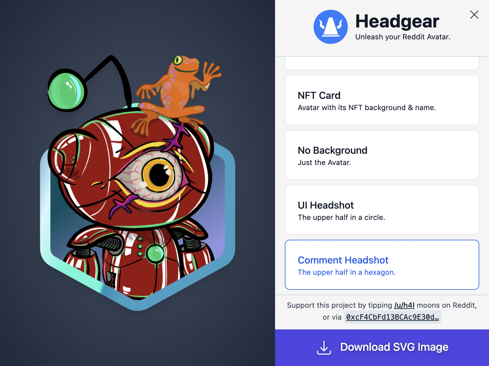
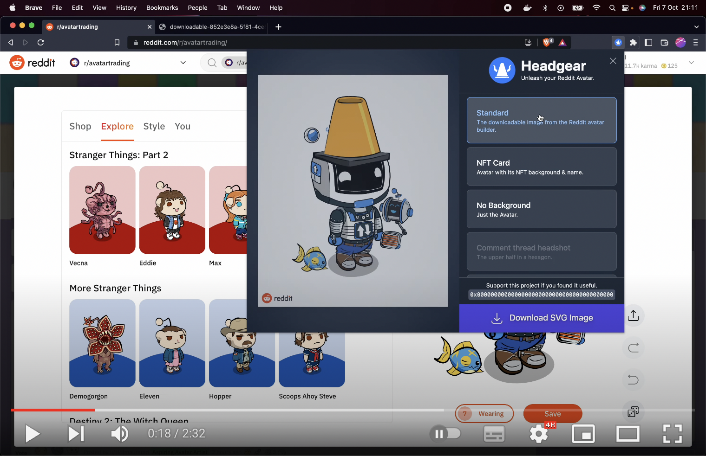

# Headgear

Headgear creates high-quality, resolution-independent images of your Reddit
Avatar (NFT or regular), allowing you to use it beyond Reddit. With images from
Headgear you can create high-quality prints, images for other social media
sites, or extract Avatar accessories to create image macros/memes or general
mash-ups.

Headgear is a browser extension that works in Chrome or Brave. Currently
Headgear needs to be a browser extension rather than a separate website because
the data it needs to create its images is not available from Reddit's public
APIs. Headgear needs to use the internal APIs used by Reddit's own Avatar
Builder and NFT shop.

## Install

**Never enter your Reddit Vault password in a browser that has extensions
installed**. See Headgear's [security advice](./docs/security.md) for more.

<dl>
  <dt>Chrome / Brave</dt>
  <dd>Install Headgear from the <a href="https://chrome.google.com/webstore/detail/headgear/enohpjpndpodijgkfibkcpfdchjhfljp" target="_blank">Chrome Web Store</a></dd>
  <dt>Edge</dt>
  <dd>Headgear supports Edge in principle, as Edge is compatible with Chrome extensions, but it's not yet been tested with Edge or submitted to the Edge Add-ons site.</dd>
  <dt>Firefox</dt>
  <dd>Firefox is not yet supported, as they've not released support for Manifest V3 extensions in their stable release yet. However they have a developer preview of Manifest V3 support now, and it seems that they'll be releasing it in a few months (as of Oct 2022).</dd>
  <dt>Other browsers</dt>
  <dd>Opera and Safari may be able to support Headgear, but this has not been investigated in any detail.</dd>
</dl>

# Quickstart

- After installing, open the Reddit website, then click Headgear under the
  Extensions toolbar item
  

- You can Pin Headgear to keep it on the toolbar
- To uninstall Headgear, click _Manage Extensions_ under the Extensions toolbar
  icon

### Demo Video

Here's a brief screencast demonstrating Headgear:

## Background & Goals

Reddit's excellent [Avatar Builder] lets users to create customised avatars to
represent themselves throughout Reddit. They have a [Share Avatar] feature that
downloads a PNG image of moderate resolution (587 × 718 pixels) and no
transparency.

Reddit recently launched [Collectable Avatars] — limited-edition Avatars that
are NFTs which are owned by their holders, and can be re-sold or transferred to
other users.

[avatar builder]:
  https://www.reddit.com/r/snoovatars/comments/jipi5d/announcing_reddits_new_avatar_builder/
[share avatar]:
  https://www.reddit.com/r/snoovatars/comments/oh2v6o/share_and_swap_avatar_looks_with_the_reddit/
[collectable avatars]:
  https://www.reddit.com/r/reddit/comments/vtkmni/introducing_collectible_avatars/

### Project Goals

- Enable Reddit users to access their Avatars in the best available quality
  - Initially this means SVG format, via the SVG assets used by the Reddit
    Avatar Builder
- Decentralise Avatar assets and data:
  - So that Reddit Avatars are not lost if Reddit stops supporting them (see
    [the previous Reddit Avatars][snoovatars])
  - To enable them to be used beyond Reddit
- Be easy to use
- Have fun

[snoovatars]:
  https://venturebeat.com/business/reddit-now-lets-you-make-your-own-snoo-avatar-adds-two-new-features/
