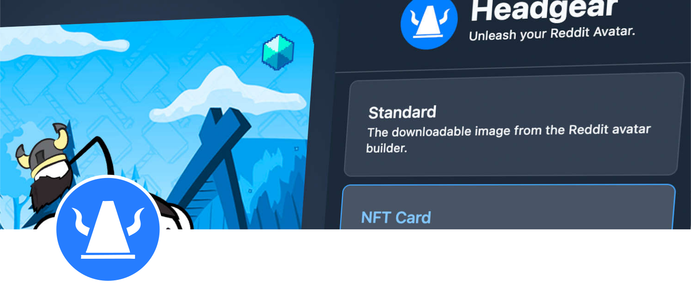
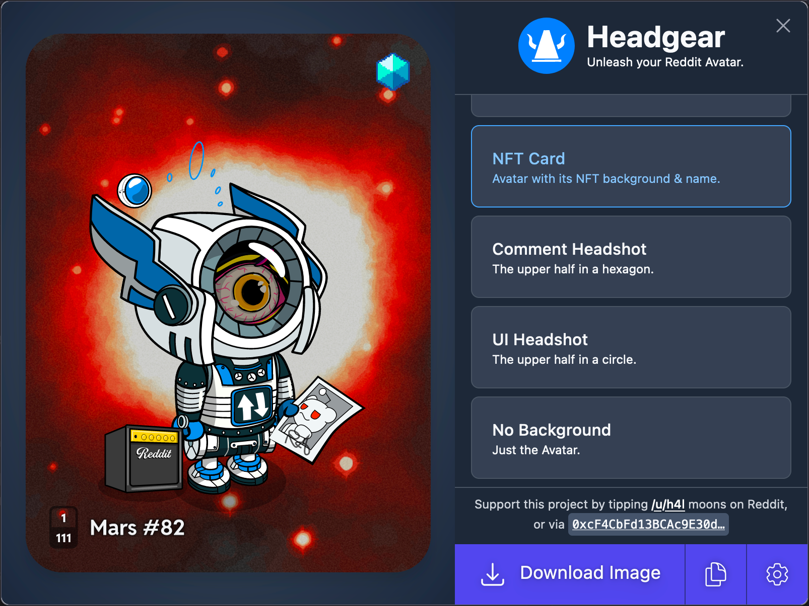
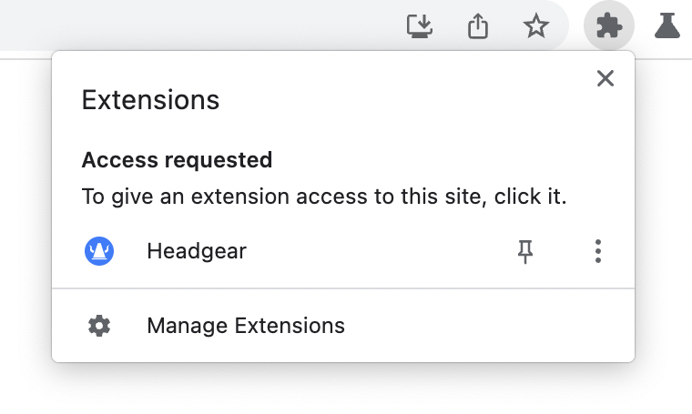
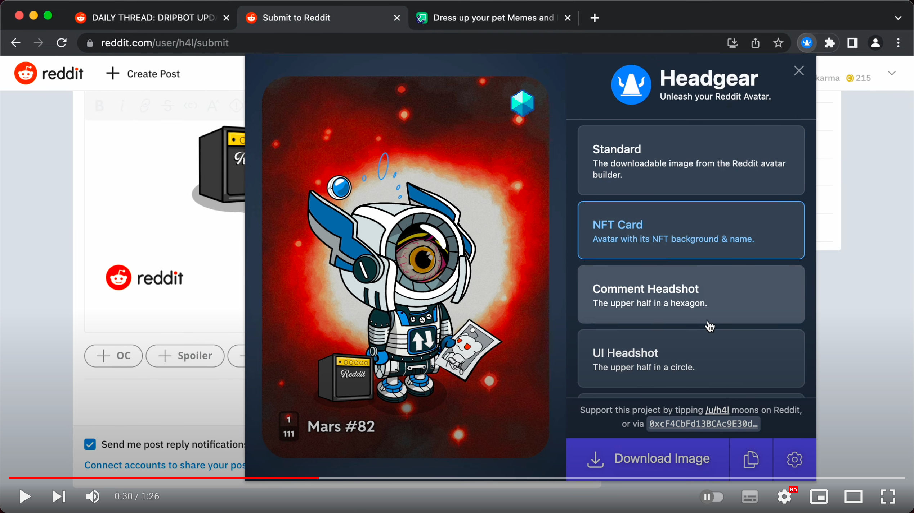

# Headgear

&nbsp;&nbsp;&nbsp;&nbsp;

Headgear creates high-quality, resolution-independent images of your Reddit
Avatar (NFT or regular), allowing you to use it beyond Reddit. With images from
Headgear you can create high-quality prints, images for other social media
sites, or extract Avatar accessories to create image macros/memes or general
mash-ups.

Headgear is a browser extension that works in Chrome or Brave. Currently
Headgear needs to be a browser extension rather than a separate website because
the data it needs to create its images is not available from Reddit's public
APIs. Headgear needs to use the internal APIs used by Reddit's own Avatar
Builder and NFT shop.

## Install

**Never enter your Reddit Vault password in a browser that has extensions
installed**. See Headgear's [security advice](./docs/security.md) for more.

<dl>
  <dt>Chrome / Edge / Brave / Opera</dt>
  <dd></dd>

  <dt>Firefox</dt>
  <dd>
  

  <ul>
  <li><strong>PENDING RELEASE OF FIREFOX 109 (expected 2023-01-17)</strong></li>
  <li><strong>PENDING Review & approval from Firefox Add-Ons (see <a href="https://github.com/h4l/headgear/issues/21">#21</a>)</strong></li>
  </ul>
  

  

  
Headgear supports Firefox from version 109 onwards — the first version with Manifest V3 extension support.
</dd>

  </dd>
  <dt>Microsoft Edge</dt>
  <dd>Edge can also install Headgear from the Chrome Web Store link above, but you need to explicitly allow Edge to use the Chrome Web Store. Edge will prompt you to enable it when you first visit. <a href="https://support.microsoft.com/en-us/microsoft-edge/add-turn-off-or-remove-extensions-in-microsoft-edge-9c0ec68c-2fbc-2f2c-9ff0-bdc76f46b026" target="_blank">Microsoft has instructions here</a>.</dd>
  <dt>Safari</dt>
  <dd>Safari can support Headgear, but Apple requires a $99/year Apple Developer Program membership to publish Safari extensions, so it's not practical to publish it with Apple.</dd>
</dl>

## Quickstart

- After installing, open the Reddit website, then click Headgear under the
  Extensions toolbar item
  

- You can Pin Headgear to keep it on the toolbar
- To uninstall Headgear, click _Manage Extensions_ under the Extensions toolbar
  icon

## Demo Video

A brief screencast demonstrating Headgear:

## Background & Goals

Reddit's excellent [Avatar Builder] lets users to create customised avatars to
represent themselves throughout Reddit. They have a [Share Avatar] feature that
downloads a PNG image of moderate resolution (587 × 718 pixels) and no
transparency.

Reddit recently launched [Collectable Avatars] — limited-edition Avatars that
are NFTs which are owned by their holders, and can be re-sold or transferred to
other users.

[avatar builder]:
  https://www.reddit.com/r/snoovatars/comments/jipi5d/announcing_reddits_new_avatar_builder/
[share avatar]:
  https://www.reddit.com/r/snoovatars/comments/oh2v6o/share_and_swap_avatar_looks_with_the_reddit/
[collectable avatars]:
  https://www.reddit.com/r/reddit/comments/vtkmni/introducing_collectible_avatars/

### Project Goals

- Enable Reddit users to access their Avatars in the best available quality
  - Initially this means SVG format, via the SVG assets used by the Reddit
    Avatar Builder
- Decentralise Avatar assets and data:
  - So that Reddit Avatars are not lost if Reddit stops supporting them (see
    [the previous Reddit Avatars][snoovatars])
  - To enable them to be used beyond Reddit
- Be easy to use
- Have fun

[snoovatars]:
  https://venturebeat.com/business/reddit-now-lets-you-make-your-own-snoo-avatar-adds-two-new-features/

## Developing Headgear

See [docs/developing.md](docs/developing.md).
